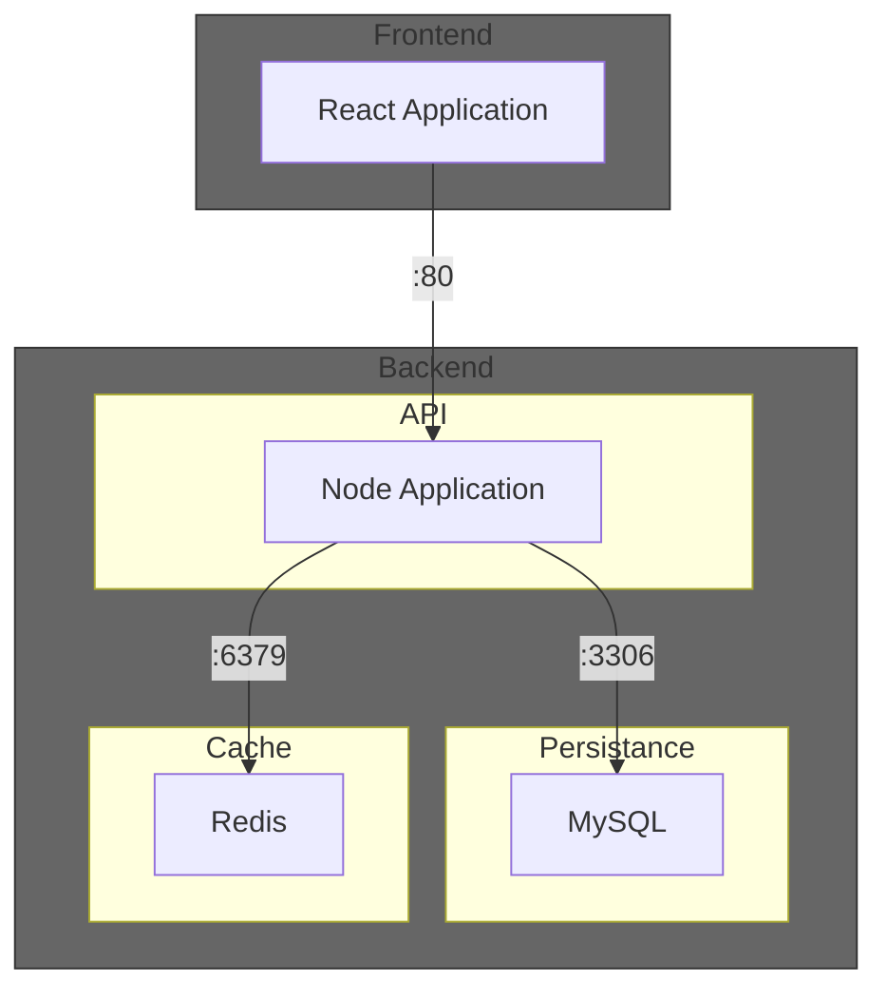

# Terraform demo with simple TODO App as an IaC example

# About Terraform in General
Terraform is an open-source tool created by Hasicorp that helps to provision the whole infrastructure in different types of Cloud Provider (i.e. AWS, Google Cloud, Azure)
It is an IaC: from configuration files, it is possible to configure the whole infrastructure.
Terraform uses an idempotence concept: a resource is not created everytime when it is applied, Terraform is able to compare a new possible state to the current state before apply a new configuration and when the new configuration is applied, just the modified resources are applied.
Terraform saves the infrastructure' state in an archive (terraform.tfstate)

[Terraform Website](https://www.terraform.io/)

## Installation
We recommend to use your package manager to install Terraform. But we can consider that Terraform is tool develop with Golang, it means its installer is basically a binary file that can be downloaded and executed.

[Terraform Installation Link](https://developer.hashicorp.com/terraform/tutorials/aws-get-started/install-cli)

### Main commands

Plan the new modifications:
`terraform plan`

Apply the new modifications:
`terraform apply`

Apply the new modifications without confirmation question:
`terraform -auto-approve`

Destroy the whole content (all created resources in the Cloud provider and the terraform.tfstate file):
`terraform destroy`

## About the TODO Application

This is a test about the capabilities and handling of different cloud service providers through hashicorps terraform (IoC).

*Sample app is originally from: https://github.com/ShrikantaMazumder/react-redis-nodejs-crud/*

Diagram of how the sample application is composed:

## Azure

### Installation Guide
1. Install [Azure CLI](https://learn.microsoft.com/en-us/cli/azure/install-azure-cli-linux?pivots=apt)
1. Link your azure account `az login`
1. Install [Terraform](https://developer.hashicorp.com/terraform/tutorials/aws-get-started/install-cli)
1. Use [Azure Provider](https://registry.terraform.io/providers/hashicorp/azurerm/latest)
1. `cd ./infra/azure/as_container_group`
1. Run `terraform plan` to check if everything is fine
1. Run `terraform apply` to set up application in azure cloud
1. Open `http://<returned ip from terraform>:3000` in browser

### Conclusion on Terraform azurerc
With the Terraform provider `azurerc`, we were able to deploy the sample application fully automated into the Microsoft Cloud within a few hours. The configuration `as_separate_services` would distribute the entire setup more elegantly. However, we could not complete and test it, as we ran out of time in the end.

**Advantages:**
+ Extensive range of services
+ Highly granular configurability
+ Clear error messages in Terraform

**Disadvantages:**
- Documentation for azurerc is sometimes very brief. Many details need to be checked directly in Azure.
- Documentation for azurerc is sometimes inconsistent
    - Example: In `azurerc_container_app`, the memory is specified with the suffix `Gi`. In `azurerm_container_group`, however, the suffix is omitted.
- Limited in the naming of resources. *(Max. 24 alphanumeric characters)*

## AWS

### Installation Guide
1. Install [AWS CLI](https://aws.amazon.com/pt/cli/)
1. Link your azure account `az login`
1. Install [Terraform](https://developer.hashicorp.com/terraform/tutorials/aws-get-started/install-cli)
1. Use [AWS Provider](https://registry.terraform.io/providers/hashicorp/aws/latest)
1. `cd ./infra/aws`
1. Run `terraform plan` to check if everything is fine
1. Run `terraform apply` to set up application in azure cloud
1. Open `http://<returned ip from terraform>:3000` in browser

### Conclusion on Terraform aws
With the Terraform provider `aws`, we were able to configure a new network in AWS:
* VPC with 2 subnets, route table, internet gateway and security policies).
* An EC2 (Elastic Compute Cloud) could be included in the subnet1 
* A repository could be created in the ECR (Elastic Cloud Registry)
The next steps are:
* Add the project images to ECR
* Create the containers in the EC2
* Make the containers available

**Advantages:**
+ Terraform can also provide an extensive range of services for AWS (the whole infrastructure can be configured for AWS)
+ Possibility of planning to see how the modification will affect the current state is very helpful
+ Clear error messages are displayed in `plan` and apply
+ Option to use `destroy` is very helpful for learning, avoiding undesirable costs in Cloud provider
+ With a small project it is possible to observe how Terraform can be useful for more complex infrastructure with its concept of "Write, Plan, Apply" and the idempotence (mentioned above)

**Disadvantages:**
- Documentation of aws provider is also brief. With the documentation it is possible to know the main properties, but there is no details how each resource should be connected with each other.
- Requires deeper know-how about AWS to build an infrastructure correctly (but the learning of Terraform can be done in parellel with AWS)
- Learning of HCL (Hashicorp Configuration Language) is necessary
- Configuration of policies requires more know-how and more
