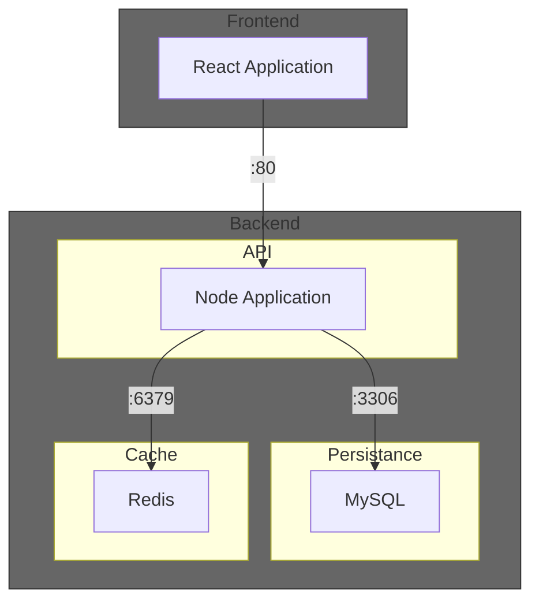

# Terraform demo with simple todo App as an IaC example

This is a test about the capabilities and handling of different cloud service providers through hashicorps terraform (IoC).

*Sample app is originally from: https://github.com/ShrikantaMazumder/react-redis-nodejs-crud/*

Diagram of how the sample application is composed:

## Azure

1. Install [Azure CLI](https://learn.microsoft.com/en-us/cli/azure/install-azure-cli-linux?pivots=apt)
1. Link your azure account `az login`
1. Install [Terraform](https://developer.hashicorp.com/terraform/tutorials/aws-get-started/install-cli)
1. Use [Azure Provider](https://registry.terraform.io/providers/hashicorp/azurerm/latest)
1. `cd ./infra/azure/as_container_group`
1. Run `terraform plan` to check if everything is fine
1. Run `terraform apply` to set up application in azure cloud
1. Open `http://<returned ip from terraform>:3000` in browser

### Conclusion on Terraform azurerc
With the Terraform provider `azurerc`, we were able to deploy the sample application fully automated into the Microsoft Cloud within a few hours. The configuration `as_separate_services` would distribute the entire setup more elegantly. However, we could not complete and test it, as we ran out of time in the end.

**Advantages:**
+ Extensive range of services
+ Highly granular configurability
+ Clear error messages in Terraform

**Disadvantages:**
- Documentation for azurerc is sometimes very brief. Many details need to be checked directly in Azure.
- Documentation for azurerc is sometimes inconsistent
    - Example: In `azurerc_container_app`, the memory is specified with the suffix `Gi`. In `azurerm_container_group`, however, the suffix is omitted.
- Limited in the naming of resources. *(Max. 24 alphanumeric characters)*
