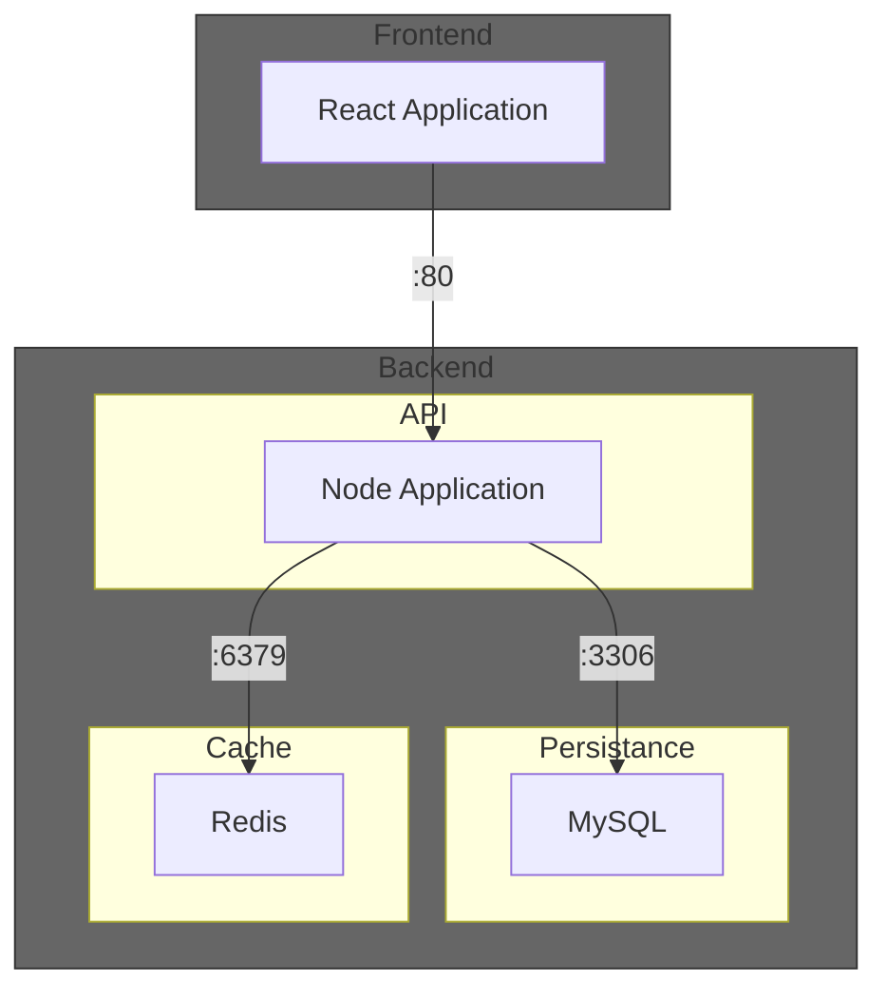

# Terraform demo with simple todo App as an IaC example

This is a test about the capabilities and handling of different cloud service providers through hashicorps terraform (IoC).

*Sample app is originally from: https://github.com/ShrikantaMazumder/react-redis-nodejs-crud/*

Diagram of how the sample application is composed:

## Azure

1. Install [Azure CLI](https://learn.microsoft.com/en-us/cli/azure/install-azure-cli-linux?pivots=apt)
1. Link your azure account `az login`
1. Install [Terraform](https://developer.hashicorp.com/terraform/tutorials/aws-get-started/install-cli)
1. Use [Azure Provider](https://registry.terraform.io/providers/hashicorp/azurerm/latest)
1. `cd ./infra/azure/as_container_group`
1. Run `terraform plan` to check if everything is fine
1. Run `terraform apply` to set up application in azure cloud
1. Open `http://<returned ip from terraform>:3000` in browser

### Fazit zu Terraform azurerc
Mit dem terraform provider `azurerc` konnte ich die Beispielanwendung innerhalb weniger Stunden vollautomatisiert in die Microsoft Cloud deployen. Die Konfiguration `as_separate_services` würde das gesamte Setup etwas eleganter verteilen. Ich konnte sie jedoch nicht abschliessen, da mir am Ende die Zeit ausging.

**Vorteile:**
+ Sehr umfangreich an Diensten
+ Sehr granular einstellbar
+ Sprechende Fehlermeldungen in Terraform

**Nachteile:**
- Dokumentation von azurerc zum Teil sehr knapp gehalten. Viele Details müssen in Azure direkt geprüft werden.
- Dokumentation von azurerc zum Teil inkonsequent
    - Beispiel: In `azurerc_container_app` wird der Arbeitsspeicher mit der Endung `Gi` angegeben. In der `azurerm_container_group` hingegen fällt die Endung weg.
- Limitiert in der Benennung von Ressourcen. *(Max. 24 alphanummerische Zeichen)*
